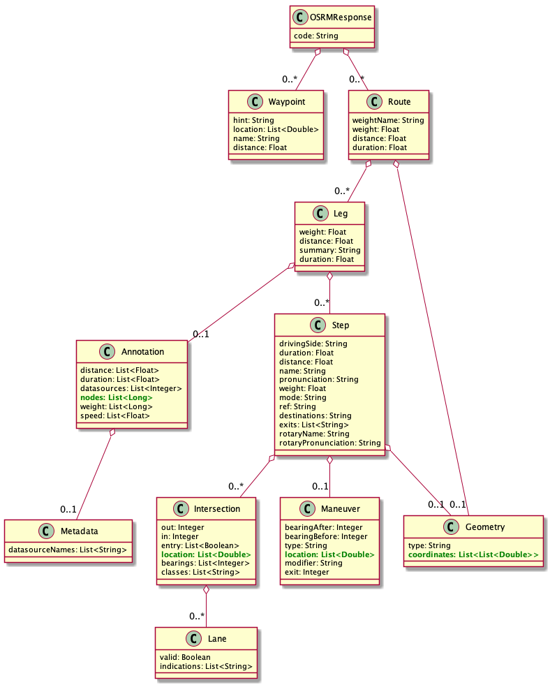
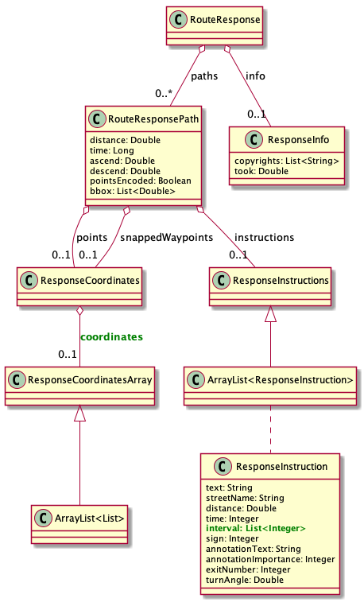
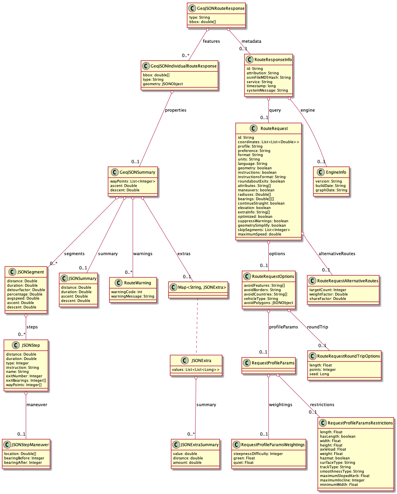

# Routing tool evaluation

We work with routing to generate additional in between stops where passengers can potentially join a ride. This must always be coordinated with the driver, whether it is a scheduled or a generated stop. This way additional pickups or drop-offs can be arranged. We also want to use routing points to shape the route. They will be saved in GTFS shapes.txt. While we need at least geo coordinates, address and time information for a GTFS stop, a GTFS route shaping point only requires the geo coordinates.

In the following three tools will be evaluated using an example ride from Berlin to Hamburg.

**Overview**

| service          | total distance      | travel time      | amount of points | average distance between points      | request time      | prices                                                                                |
|------------------|--------------------:|-----------------:|------------------|-------------------------------------:|------------------:|---------------------------------------------------------------------------------------|
| OSRM             | 280&nbsp;km         | 3,1&nbsp;h       | 32/239/2.644/..  | 8.766/1.173/106&nbsp;m               | 6.200&nbsp;ms     | free commercial usage                                                                 |
| GraphHopper      | 281&nbsp;km         | 2,8&nbsp;h       | 23/1432          | 12.204/196&nbsp;m                    | 610&nbsp;ms       | registration required, commercial use starting from 48 €/month for 1.666 requests/day |
| openrouteservice | 280&nbsp;km         | 2,9&nbsp;h       | 27/2086          | 10.383/134&nbsp;m                    | 6.600&nbsp;ms     | registration required, free commercial usage up to 2.000 requests/day                 |

Other pay services are provided by
* Google Maps
* HERE
* Mapbox
* Microsoft
* TomTom
* MapQuest
* ArcGIS   
...

### OSRM

* GitHub: [https://github.com/Project-OSRM/osrm-backend](https://github.com/Project-OSRM/osrm-backend)
* API documentation: [http://project-osrm.org/docs/v5.22.0/api/](http://project-osrm.org/docs/v5.22.0/api/)

The OSRM routing response has different collections of generated routing points as listed in the table.

| routing point type        | generated in                                             | amount of points |
|---------------------------|----------------------------------------------------------|-----------------:|
| driving instruction point | route.leg.step.maneuver.location                         | 32               |
| street intersection point | route.leg.step.intersection.location                     | 239              |
| route shaping point (1)   | route.geometry.coordinate                                | 2612             |
| route shaping point (2)   | route.leg.step.geometry.coordinate                       | 2644             |
| route shaping point (3)   | route.leg.annotation.node with OSM id instead of lat,lon | 2612             |

**response model**   

[and the example result as JSON](pages/routing_osrm_response_json.md)

**driving instruction points**   

**street intersection points**   

**route shaping points (1)**   

**route shaping points (2)**   

**route shaping points (3)**   

The first Google Earth picture shows all the routing points where direction is changing. A lot of them are close to the origin and the destination, but not so many in between. In the second picture the street intersection points are more equally spread along the route. And where routes are crossing there are possibilities to enter/exit rides. Unfortunately intersection points don't have a duration between two like the direction points and this is required for GTFS stops. To calculate them separately might be too time-consuming.

The last three pictures include all the in between points for drawing the route. This can be used for the GTFS shapes.

With the help of Photon we get a view where the routing points are located.

**driving instruction points**

| longitude,latitude             | osm _key | house no. | city          | street                   | osm_value         | post-code | name                     | state       |
|--------------------------------|----------|-----------|---------------|--------------------------|-------------------|-----------|--------------------------|-------------|
| 13.3816639,52.5316801          | railway  |           | Berlin        | Chausseestraße           | subway_entrance   | 10115     | U Naturkundemuseum       | Berlin      |
| 13.3717709,52.5390625          | highway  |           | Berlin        |                          | secondary         | 13353     | Pankenbrücke             | Berlin      |
| 13.3321246,52.5619817          | place    | 1         | Berlin        | Scharnweberstraße        | house             | 13405     |                          | Berlin      |
| 13.3306441,52.5626152          | place    |           | Berlin        |                          | postcode          | 13405     |                          | Berlin      |
| 13.3267151,52.562555           | highway  |           | Berlin        |                          | primary           | 13405     | Kapweg                   | Berlin      |
| 13.3224464,52.5606162          | highway  |           | Berlin        |                          | primary           | 13405     | Kurt-Schumacher-Damm     | Berlin      |
| 13.3123812,52.5648813          | highway  |           | Berlin        |                          | motorway_junction | 13405     | Eichborndamm             | Berlin      |
| 13.3063887,52.5674806          | highway  |           | Berlin        |                          | motorway_junction | 13405     | Kurt-Schumacher-Platz    | Berlin      |
| 13.2006461,52.6957881          | highway  |           | Velten        |                          | motorway_junction | 16767     | Kreuz Oranienburg        | Brandenburg |
| 13.1764499,52.7058281          | highway  |           | Velten        |                          | motorway          | 16727     | Nördlicher Berliner Ring | Brandenburg |
| 13.0308651,52.7098808          | highway  |           | Oberkrämer    | Westlicher Berliner Ring | motorway_junction | 16727     | Dreieck Havelland        | Brandenburg |
| 12.4624524,53.1232044          | highway  |           | Heiligengrabe |                          | motorway_junction | 16909     | Dreieck Wittstock/Dosse  | Brandenburg |
| 10.0698666,53.5596599          | highway  |           | Hamburg       |                          | primary           | 22111     | Sievekingsallee          | Hamburg     |
| 10.0695751,53.5596008          | highway  |           | Hamburg       |                          | primary           | 22111     | Sievekingsallee          | Hamburg     |
| 10.0534485,53.5610705          | highway  |           | Hamburg       |                          | residential       | 20535     | Schulenbeksweg           | Hamburg     |
| 10.0419958,53.555555           | highway  |           | Hamburg       |                          | secondary         | 20537     | Hammer Landstraße        | Hamburg     |
| 10.0406689,53.5555759          | highway  |           | Hamburg       |                          | secondary         | 20537     | Hammer Landstraße        | Hamburg     |
| 10.0265681,53.5538048          | highway  |           | Hamburg       |                          | residential       | 20537     | Klaus-Groth-Straße       | Hamburg     |
| 10.0243027,53.5535981          | highway  |           | Hamburg       |                          | secondary         | 20099     | Berlinertordamm          | Hamburg     |
| 10.0192246,53.5527811          | highway  |           | Hamburg       |                          | secondary         | 20097     | Kurt-Schumacher-Allee    | Hamburg     |
| 10.0185868,53.5526014          | highway  |           | Hamburg       |                          | secondary         | 20097     | Kurt-Schumacher-Allee    | Hamburg     |
| 10.017895,53.5527903           | highway  |           | Hamburg       |                          | residential       | 20097     | Adenauerallee            | Hamburg     |
| 10.0088771,53.5522089          | highway  |           | Hamburg       |                          | secondary         | 20099     | Steintorplatz            | Hamburg     |
| 10.005776522160406, 53.5520385 | shop     |           | Hamburg       | Wallringtunnel           | bakery            | 20095     | Tunnel Bäcker            | Hamburg     |
| 10.0056237,53.552885           | amenity  |           | Hamburg       | Wallringtunnel           | cafe              | 20095     | Starbucks                | Hamburg     |
| 10.0038483,53.5541033          | highway  |           | Hamburg       |                          | secondary         | 20095     | Glockengießerwall        | Hamburg     |
| 10.0025086,53.5534776          | highway  |           | Hamburg       |                          | unclassified      | 20095     | Brandsende               | Hamburg     |
| 9.999922,53.5549622            | highway  |           | Hamburg       |                          | tertiary          | 20095     | Ballindamm               | Hamburg     |
| 9.9945103,53.552045            | highway  |           | Hamburg       |                          | tertiary          | 20095     | Jungfernstieg            | Hamburg     |
| 9.9951072,53.5511752           | highway  |           | Hamburg       |                          | pedestrian        | 20095     | Hermannstraße            | Hamburg     |
| 9.9942354,53.5506939           | highway  |           | Hamburg       |                          | unclassified      | 20095     | Rathausmarkt             | Hamburg     |
| 9.9936264,53.5510823           | highway  |           | Hamburg       |                          | unclassified      | 20095     | Rathausmarkt             | Hamburg     |

### GraphHopper

* GitHub: [https://github.com/graphhopper/directions-api-clients/tree/master/java](https://github.com/graphhopper/directions-api-clients/tree/master/java)

| routing point type        | generated in              | amount of points |
|---------------------------|---------------------------|-----------------:|
| driving instruction point | path.instruction.interval | 23               |
| route shaping point       | path.points.coordinate    | 1432             |

**response model**   

[and the example result as JSON](pages/routing_gh_response_json.md)

**driving instruction points**   

**route shaping points**   

### openrouteservice

* GitHub: [https://github.com/GIScience/openrouteservice](https://github.com/GIScience/openrouteservice)
* API documentation: [https://openrouteservice.org/dev/#/api-docs/directions/get](https://openrouteservice.org/dev/#/api-docs/directions/get)

| routing point type        | generated in                             | amount of points |
|---------------------------|------------------------------------------|-----------------:|
| driving instruction point | feature.properties.segment.step.waypoint | 27               |
| route shaping point       | feature.geometry.coordinate              | 2086             |

**response model**   

[and the example result as JSON](pages/routing_ors_response_json.md)

**driving instruction points**   

**route shaping points**   

